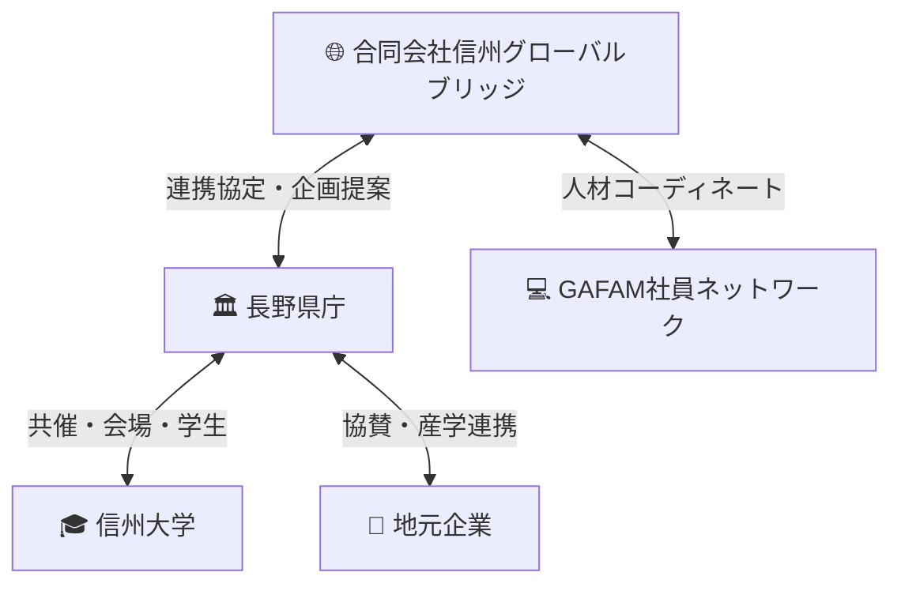

# 🏔 NAGANO GLOBAL BRIDGE — テック × 地方創生プロジェクト

> **長野県から世界へ、世界から長野県へ。**
> GAFAM人材と地域をつなぎ、次世代の人的資本を育てる官民連携プログラム。

---

## 🏢 運営主体

**合同会社信州グローバルブリッジ**（Shinshu Global Bridge LLC）

| 項目 | 内容 |
|------|------|
| **法人形態** | 合同会社（LLC） |
| **登記所在地** | 長野県（予定） |
| **事業目的** | テック人材と地域社会をつなぐハブとして、人材育成・産業DX・関係人口創出を推進 |
| **ステータス** | 設立準備中 |

> 本法人がプロジェクト全体の**企画・運営・調整のハブ**となり、長野県・教育機関・地元企業・GAFAM人材をつなぎます。

---

## 📌 プロジェクト概要

長野県出身のGAFAM（Google / Apple / Facebook / Amazon / Microsoft）社員が中心となり、**合同会社信州グローバルブリッジ**を通じて長野県と連携し、**若者のキャリア支援**・**地域産業のDX推進**・**関係人口の創出**を目指す取り組みです。

### 🎯 ミッション

- 若者の県外流出を「関係人口」の形で価値に変える
- 地域企業とグローバルテック人材の接点を創出する
- 将来的なUターン・Iターンの確率を高める
- **人的資本投資施策**として長野県の未来に貢献する

---

## 💡 3つのソリューション

### ① GAFAMキャリアラウンドテーブル（少人数制）

> 「講演」ではなく「対話」。等身大の言葉で、未来を一緒に考える。

| 項目 | 内容 |
|------|------|
| **対象** | 長野県内の大学生・高校生（選抜制） |
| **形式** | オンライン＋年1回リアル開催（長野市 or 松本市） |
| **規模** | GAFAM社員 5名程度 × 学生 15〜20名 |
| **時間** | 90分ディスカッション形式 |

#### 📝 テーマ例

- **なぜ長野からGAFAMに？** — キャリアパスのリアル
- **英語どうやって勉強した？** — 実践的な学習法
- **大学生のうちにやるべきこと** — 今から始められるアクション
- **AI時代に必要なスキル** — テクノロジーと共存する力

#### ✨ ポイント

- 一方通行の講演ではなく、**双方向の対話形式**
- 少人数制により、一人ひとりの質問・悩みに向き合える
- 選抜制にすることで参加者のモチベーションを担保

---

### ② テーマ型セッション（AI × 長野産業）

> 長野の強みとテクノロジーを掛け合わせ、地域産業の未来を描く。

長野県の主要産業に生成AI・データ活用技術を掛け合わせた実践的セッション。

| セッションテーマ | 内容 |
|------------------|------|
| 🌾 **生成AI × 農業** | スマートアグリ — 収穫予測・病害虫検知・データ駆動型農業 |
| 🏭 **データ活用 × 製造業** | 品質検査自動化・予知保全・サプライチェーン最適化 |
| 🏔 **生成AI × 観光** | インバウンドDX・多言語対応・パーソナライズド観光体験 |
| 🔧 **データ活用 × 精密機械** | 画像認識による検品・生産ライン最適化 |

#### 🔑 テクノロジーの活用ポイント

- **生成AI**を活用した業務効率化・新サービス創出
- **データ分析・可視化**による意思決定の高度化
- クラウド・AI技術を活かした地域DXの実践事例紹介

> 💡 県庁の産業政策と直結するテーマ設計により、行政との連携がスムーズに。

---

### ③ メンタリング制度（半年プログラム）

> 継続的な伴走で、一人ひとりの可能性を最大化する。

希望者を対象とした6ヶ月間のメンタリングプログラム。

| 項目 | 内容 |
|------|------|
| **期間** | 6ヶ月（前期・後期で年2回募集） |
| **頻度** | 月1回オンライン（60分） |
| **対象** | ラウンドテーブル参加者から希望者を選抜 |

#### 📚 サポート内容

- **キャリア相談** — 進路選択・就職活動・業界研究
- **英語勉強法** — 実務で使える英語力の鍛え方
- **海外志向サポート** — 留学・海外就職に向けた具体的なステップ
- **テクニカルスキル** — プログラミング・AI/MLの学習ロードマップ

#### 📊 期待される成果

| KPI | 目標 |
|-----|------|
| メンタリング完遂率 | 80%以上 |
| 参加者満足度 | 4.5/5.0以上 |
| IT/テック系進路選択率 | 前年比+15% |
| 長野県との関係継続意向 | 90%以上 |

---

## 🏛 長野県との連携体制

### 運営スキーム



### カウンターパート候補

| 組織 | 役割 | 信州グローバルブリッジとの関係 |
|------|------|------|
| **産業労働部** | 産業DX施策との連携・予算確保 | 連携協定・事業委託 |
| **産業立地・IT振興課** | IT人材育成施策との接続 | 共同企画 |
| **教育委員会** | 高校生向けプログラムの展開 | 後援・学校連携 |
| **信州大学** | 大学生の参加促進・会場提供 | 共催パートナー |

### 📈 この取り組みの価値

長野県では若者の県外流出が続いていますが、流出そのものを止めるのではなく、**「関係人口」を作る**ことに意味があると考えています。

- 県外に出た若者が、長野県とのつながりを保ち続ける
- GAFAM人材と地元学生の間に継続的な接点が生まれる
- 将来的なUターン・Iターンの可能性が自然と高まる
- 地域企業がグローバル人材のネットワークにアクセスできる

この取り組みは、短期的な成果ではなく、**長野県の未来への人的資本投資**として位置づけられるものです。

---

## 🧨 発展構想：NAGANO GLOBAL DAY

> 年1回の大型イベントとして、長野県主催での開催を目指す。

### 🗓 イベント概要

| 項目 | 内容 |
|------|------|
| **名称** | NAGANO GLOBAL DAY |
| **頻度** | 年1回 |
| **会場** | 長野市 or 松本市（ハイブリッド開催） |
| **主催** | 合同会社信州グローバルブリッジ（共催：長野県、信州大学、地元企業） |

### 🎤 プログラム構成

```
09:00  開会・知事挨拶
09:30  基調講演 — GAFAM社員によるキーノート
10:30  パネルディスカッション — 地元企業経営者 × テック人材
12:00  昼食・ネットワーキング
13:00  AI × 長野産業 テーマ別セッション（3トラック並行）
15:00  高校生プレゼン大会 — 「テクノロジーで長野を変える」
16:30  AIアイディアコンテスト — 審査・表彰
17:30  クロージング・次年度構想発表
18:00  懇親会
```

### 🏆 AIアイディアコンテスト

- 長野県の課題をAIで解決するアイディアを募集
- 高校生・大学生チームによるプレゼン
- GAFAM社員が審査員として参加
- 最優秀チームには**メンタリング特別枠**を提供

---

## 🧭 プロジェクトの立ち位置

### 将来的な展開

| フェーズ | 内容 |
|----------|------|
| **Phase 0**（準備期） | 合同会社信州グローバルブリッジ設立・長野県との連携協議開始 |
| **Phase 1**（1年目） | ラウンドテーブル・メンタリング開始 |
| **Phase 2**（2年目） | テーマ型セッション追加・NAGANO GLOBAL DAY初開催 |
| **Phase 3**（3年目〜） | 県アドバイザー就任・地域DX推進委員としての政策関与 |

### 🔮 ビジョン

- ✅ **合同会社信州グローバルブリッジ**をテック × 地方創生の中核法人に
- ✅ **長野県アドバイザー**として地域テック政策に関与
- ✅ **地域DX推進委員**として産業変革を支援
- ✅ **全国モデルケース**として他県への横展開
- ✅ 将来的な**政策関与・制度設計**への参画

---

##  発起人プロフィール

### 宮坂 航亮（Kosuke Miyasaka）

| 所属 | 役職 |
|------|------|
| **日本マイクロソフト株式会社** | Cloud Specialist App Innovation |
| **株式会社スターク・インダストリーズ** | Chief Technology Officer |
| **地元IT研究所** | 個人事業 |
| **合同会社信州グローバルブリッジ** | 設立予定 |

#### 経歴

長野県立上田高校（野球班）を経て、慶應義塾大学・同大学院を卒業。2017年に日本マイクロソフト株式会社にフィールドエンジニアとして入社し、日系大手企業のアジャイル開発やクラウド導入を支援。その後、アプリケーションデベロップメントマネジャーとしてDevOpsやクラウドネイティブの導入支援をリードした。

現在はソリューションスペシャリストとして、**生成AI・AIエージェント**領域を中心に活動。企業の生成AIプロジェクトを多数リードし、AIエージェントを活用した業務変革やアプリケーション開発を推進している。クラウドネイティブ・DevOpsの知見を土台に、AI時代の新しいアプリケーションの在り方を企業へ提案している。

トヨタ自動車様の事例を中心にAIエージェントプロジェクト推進のリーダーを務め、**2025年度 Microsoft Pinnacle Award**を受賞。

#### 地方創生への想い

長野県の温泉街出身ということから、地元×ITに興味をもち、地方自治体に対する講演や地方中小企業のIT導入支援も実施している。

#### 関連記事

- [トヨタ自動車、エンジニアの知見を AI エージェントで継承へ ― 競争力強化に向け革新的な取り組みを開始](https://news.microsoft.com/ja-jp/features/241120-toyota-is-deploying-ai-agents-to-harness-the-collective-wisdom-of-engineers-and-innovate-faster/)
- [ウーブン・バイ・トヨタが生成AIを車載ソフトウェア「MISRA」準拠に活用、コード修正の約 80％ を自動化](https://www.microsoft.com/ja-jp/customers/story/23667-woven-by-toyota-co-ltd-azure)
- [トヨタコネクティッドは、新たな事業の種として 生成AI を用いた音声ラジオシステムを構築](https://www.microsoft.com/ja-jp/customers/story/23110-toyota-connected-azure)

#### リンク

[](https://github.com/komiyasa)
[](https://qiita.com/Komiyasa)

---

<p align="center">
  <strong>🏔 長野から世界へ、世界から長野へ 🌏</strong><br>
  <em>Built with ❤️ for Nagano</em>
</p>
